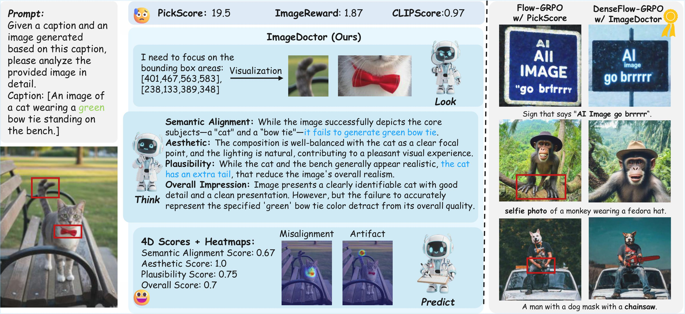

#  ImageDoctor: Rich Feedback for Text-to-Image Generation through Grounded Image Reasoning


[](https://arxiv.org/abs/2510.01010)
[](https://huggingface.co/GYX97/ImageDoctor)
[](https://image-doctor.github.io/)


**ImageDoctor** is a unified **evaluation framework** for **text-to-image (T2I)** generation.  
It produces both **multi-aspect scalar scores** (semantic alignment, aesthetics, plausibility, overall) and **spatially grounded heatmaps**, following a novel **“look–think–predict”** paradigm inspired by human diagnosis.

<p align="center">
  
</p>


---

## 🧩 Table of Contents
- [Overview](#-overview)
- [Key Features](#-key-features)
- [Environments](#-environments)
- [Inference](#-inference)
- [Citation](#-citation)
- [Acknowledgement](#-acknowledgement)

---

## 📘 Overview

Recent advances in text-to-image (T2I) generation have yielded increasingly realistic and instruction-following images.  
However, evaluating such results remains challenging — most existing evaluators output a single scalar score, which fails to capture localized flaws or provide interpretable feedback.

**ImageDoctor** fills this gap by introducing **dense, grounded evaluation**:
- It scores each image across **multiple dimensions**,  
- Localizes artifacts and misalignments using **heatmaps**,  
- And explains its reasoning step-by-step using **grounded image reasoning**.

---

## 🚀 Key Features

- **🎯 Multi-Aspect Evaluation**  
  Predicts four interpretable quality dimensions:  
  `Semantic Alignment · Aesthetics · Plausibility · Overall Quality`

- **🗺️ Spatially Grounded Feedback**  
  Generates **heatmaps** highlighting artifact and misalignment regions, providing fine-grained supervision and interpretability.

- **🧠 Grounded Image Reasoning**  
  Follows a **look–think–predict** paradigm:  
  - *Look:* Identify potential flaw regions  
  - *Think:* Analyze and reason about these regions  
  - *Predict:* Produce final scores and diagnostic heatmaps  
  The model can even **zoom in** on localized regions when reasoning, mimicking human evaluators.

- **⚙️ GRPO Fine-Tuning**  
  ImageDoctor is refined through **Group Relative Policy Optimization (GRPO)** with a **grounding reward**, improving spatial awareness and preference alignment.

- **🧩 Versatile Applications**
  - ✅ Evaluation metric  
  - ✅ Reward function in RL for T2I models (DenseFlow-GRPO)  
  - ✅ Verifier for test-time scaling and re-ranking

---

## 🧱 Environments

```bash
# Create a new conda environment from environment.yaml
conda env create -f environment.yaml

# Activate it
conda activate imagedoctor

```

---

## 🧠 Inference

```python
from transformers import AutoProcessor, AutoModelForVision2Seq
from PIL import Image
import torch

model_id = "yuxiangguo/ImageDoctor"
model = AutoModelForVision2Seq.from_pretrained(model_id, torch_dtype=torch.float16).eval().cuda()
processor = AutoProcessor.from_pretrained(model_id)

prompt = "A cat wearing sunglasses sitting on the beach."
image = Image.open("cat_beach.png").convert("RGB")

inputs = processor(prompt, images=image, return_tensors="pt").to(model.device)
outputs = model.generate(**inputs, max_new_tokens=512)
response = processor.batch_decode(outputs, skip_special_tokens=True)[0]

print("🩺 ImageDoctor Evaluation:\n", response)
```
<!--

---

## 🌈 Heatmap Visualization

```python
import matplotlib.pyplot as plt
import numpy as np

heatmaps = model(**inputs, output_heatmaps=True).heatmaps  # {'artifact': tensor, 'misalignment': tensor}

for k, v in heatmaps.items():
    plt.figure(figsize=(4, 4))
    plt.imshow(np.array(image))
    plt.imshow(v.squeeze().cpu().numpy(), cmap="jet", alpha=0.5)
    plt.title(f"{k.capitalize()} Heatmap")
    plt.axis("off")
    plt.show()
```

---

## 🧩 Applications

| Role | Description |
|------|--------------|
| **Metric** | Evaluate text-image alignment and visual plausibility with interpretable scores. |
| **Verifier** | Select best image among candidates in test-time scaling setups. |
| **Reward Model** | Provide **dense spatial feedback** for RLHF in diffusion/flow models (DenseFlow-GRPO). |

---

## ⚙️ Training Pipeline

ImageDoctor is trained in **two phases**:

1. **Cold-Start Stage** — Supervised fine-tuning on RichHF-18K to predict multi-aspect scores and heatmaps.  
2. **Reinforcement Stage (GRPO)** — Refines reasoning and grounding using group-relative policy optimization with custom grounding rewards.

<p align="center">
  
</p>

---

-->

## 🧾 Citation

If you use **ImageDoctor** in your research, please cite:

```bibtex
@misc{guo2025imagedoctordiagnosingtexttoimagegeneration,
  author    = {Yuxiang Guo, Jiang Liu, Ze Wang, Hao Chen, Ximeng Sun, Yang Zhao, Jialian Wu, Xiaodong Yu, Zicheng Liu and Emad Barsoum},
  title     = {ImageDoctor: Diagnosing Text-to-Image Generation via Grounded Image Reasoning}, 
  eprint    = {2510.01010},
  archivePrefix={arXiv},
  year      = {2025},
  url       = {https://arxiv.org/abs/2510.01010}, 
```

---

## 🙏 Acknowledgement

ImageDoctor builds upon:
- [Qwen2.5-VL](https://huggingface.co/Qwen/Qwen2.5-VL-7B-Instruct) – Vision-Language foundation
- [RichHF-18K](https://huggingface.co/datasets/yuxiangguo/RichHF-18K) – Multi-aspect human preference dataset
- [Flow-GRPO](https://github.com/flow-grpo/flow-grpo) – Reinforcement Learning base framework

---

## 📄 License

Released under the **Apache 2.0 License** for research and non-commercial use.

